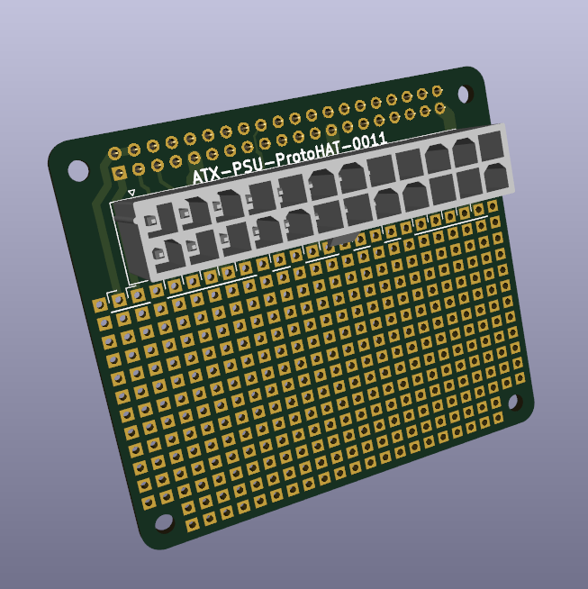
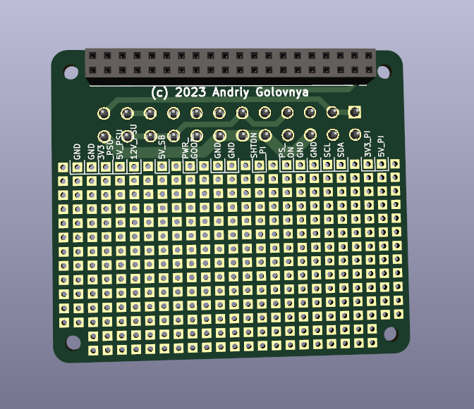

# ATX-PSU-ProtoHAT project

ATX-PSU-ProtoHAT project test HAT board for ATX PSU.

## ATX-PSU-ProtoHAT

**ATX-PSU-ProtoHAT** is a prototyping HAT board for DIY use.
This board features Raspberry Pi and ATX PSU connector.

Preview:

[Schematics in PDF format](doc/ATX-PSU-ProtoHAT.pdf)

Features:

- Raspberry Pi 40-pin connector
- ATX PSU 24-pin connector
- DIY raster DOT area for prototyping

CAM files are available.

## Version History

### v1.1

- Fixed board geomery to fit better to Rasperry Pi HAT spec
- Added few more DIY raster lines
- Fixed typo in pad's description
- Moved texts around

### v1.0

Initial release

## Links

- [pinout.xyz](https://pinout.xyz/) - a brilliant resource on topic of Pi's pinout and HATs.
- [raspberrypi/hats](https://github.com/raspberrypi/hats) - Raspberry Pi HAT specification.
- [Wikipedia:ATX](https://en.wikipedia.org/wiki/ATX) - lengthy decription of ATX standard, including PSU pinout.

## How to help

Your contributions as code, resources, or finances are welcome! Please contact me directly via email at andriy.golovnya@gmail.com or through my [GitHub profile](https://github.com/red-scorp).

If you'd like to make a financial contribution, you can donate via [PayPal](http://paypal.me/redscorp) or [Ko-Fi](http://ko-fi.com/redscorp). Your support is greatly appreciated.

Thanks in advance!
